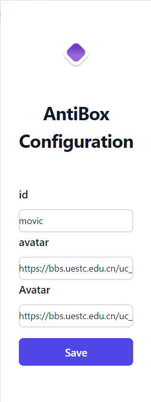

# AntiBox

清水河畔防开盒浏览器插件


## Introduction

为了防止Uestcer在图书馆，教学楼等地方水河畔时被开盒，movic特别开发了AntiBox浏览器插件。

AntiBox基于[Plasmo](https://www.plasmo.com/)框架，支持Edge、Chrome、Firefox、Safari等多种主流浏览器。




## Installation

1. Install `pnpm` follow [this tutorial](https://www.pnpm.cn/installation)

2. Install or upgrade `Node.js` by following steps:
   1. Download from: https://nodejs.org/en
   2. Install


## Getting Started

This is a [Plasmo extension](https://docs.plasmo.com/) project bootstrapped with [`plasmo init`](https://www.npmjs.com/package/plasmo).

First, run the development server:

```bash
pnpm dev
# or
npm run dev
```

Open your browser and load the appropriate development build. For example, if you are developing for the chrome browser, using manifest v3, use: `build/chrome-mv3-dev`.

You can start editing the popup by modifying `popup.tsx`. It should auto-update as you make changes. To add an options page, simply add a `options.tsx` file to the root of the project, with a react component default exported. Likewise to add a content page, add a `content.ts` file to the root of the project, importing some module and do some logic, then reload the extension on your browser.

For further guidance, [visit our Documentation](https://docs.plasmo.com/)


## Making production build

Run the following:

```bash
pnpm build
# or
npm run build
```

This should create a production bundle for your extension, ready to be zipped and published to the stores.

To build with a specific target:

```bash
pnpm build --target=firefox-mv2
```

See [what are the officially supported browser targets](https://docs.plasmo.com/framework/workflows/faq#what-are-the-officially-supported-browser-targets) for all available targets.


## Submit to the webstores

The easiest way to deploy your Plasmo extension is to use the built-in [bpp](https://bpp.browser.market) GitHub action. Prior to using this action however, make sure to build your extension and upload the first version to the store to establish the basic credentials. Then, simply follow [this setup instruction](https://docs.plasmo.com/framework/workflows/submit) and you should be on your way for automated submission!
